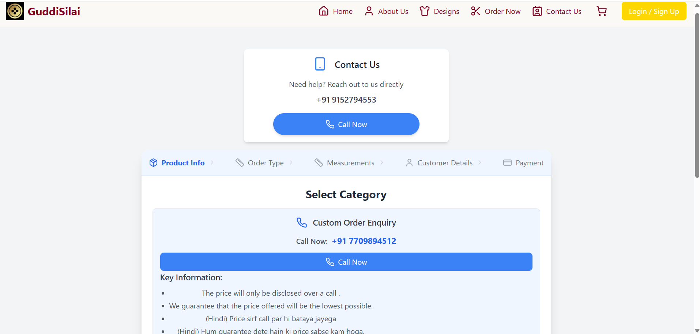

# GudiSilai – (SilaiHub) 🧵 

**सिलाई की दुनिया, अब ऑनलाइन**


---

Welcome to **GuddiSilai (SilaiHub)** – your one-stop platform for beautifully crafted, custom-stitched clothing by skilled hands.

> "Every stitch tells a story — handcrafted with care, delivered with love."

✨ **10+ saal ka tajurba (experience)**  
🪡 **500+ blouses ki silai**  
🎨 **150+ unique designs** – har ek mein apni baat

---

## 🌐 Live Demo
-
🚧 https://version1gsocs.vercel.app/contact (Working in progress some parts are not functional)

---

## UI Preview
Take a look at some screenshots of the website interface:

## 🏠 Homepage


---

## 🔐 Sign In Page


---

## 🎨 Design Space


---

## ☎️ Contact Us Page


---

## ☎️ Order Now Page




---

## ✨ Key Features

- 👗 **Book stitching services** for Blouses, Lehengas, and Dresses  
- 🧵 **Browse designs** and place custom tailoring orders  
- 📐 **Add measurements** and personalize outfits with ease  
- 🔐 **Login securely** using Google OAuth  
- ⚙️ **Admin panel** for managing orders and designs 
- 🔍 **SEO-ready** with automated sitemap generation

---

## 🛠️ Tech Stack

| 📦 Layer           | 🔧 Technologies Used                         |
|--------------------|-----------------------------------------------|
| 🎨 Frontend        | React.js, Tailwind CSS                        |
| ⚙️ Backend         | Node.js, Express.js                           |
| 🔐 Authentication  | Google OAuth, JWT                             |
| 🗄️ Database        | MongoDB (via MongoDB Atlas – Cloud Hosted)    |
| 🚀 Deployment      | Vercel (Frontend) & Render (Backend)          |

---
# 🎨 GuddiSilai Color Palette

This color palette is crafted to represent **royalty**, **affordability**, and the essence of **blouse stitching and tailoring** for the **GuddiSilai** brand.

---

## 🌟 Brand Colors

| Color Name       | Hex Code   | Preview                                                         | Usage                         |
|------------------|------------|-----------------------------------------------------------------|-------------------------------|
| Royal Maroon     | `#800000`  |  | Buttons, headers              |
| Soft Peach       | `#FFE5B4`  |  | Backgrounds, soft sections    |
| Gold Dust        | `#D4AF37`  |  | Borders, icons, accents       |
| Slate Grey       | `#4A4A4A`  |  | Main text                     |
| Thread Blue      | `#6C8CD5`  |  | Hover, highlights, buttons    |

---

## 📂 Project Structure


guddisilai/
├── backend/                # Express Backend
│   ├── Config/
│   ├── Controller/
│   ├── Middleware/
│   ├── Models/
│   ├── Routes/
│   └── app.js
│
├── public/                 # Public assets
│
├── src/                    # React Frontend
│   ├── Assist/
│   ├── Common/
│   ├── Components/
│   ├── Context/
│   ├── Pages/
│   ├── Routers/
│   ├── App.js
│   ├── App.css
│   ├── index.js
│   └── index.css
│
├── .gitignore
├── README.md
├── package.json
├── package-lock.json
├── generate-sitemap.js
├── tailwind.config.js
├── vercel.json

````
---

## 🚀 Getting Started (Local Setup)

### 1️⃣ Clone the Repository

```bash
git clone https://github.com/deepakcs2003/guddisilai.git
cd guddisilai
````

---

### 2️⃣ Backend Setup (`/backend`)

```bash
cd backend
npm install
cp .env.example .env  # Fill your credentials
npm start
```

> Backend runs on: `http://localhost:5000`

---

### 3️⃣ Frontend Setup (`/src` root)

```bash
npm install
cp .env.example .env  # Frontend Google Client ID
npm start
```

> Frontend runs on: `http://localhost:3000`

---

## 🔐 Environment Variables

### 📁 `/backend/.env.example`

```env
# Server Port
PORT=5000

# MongoDB URI
MONGO_URI=your_mongodb_uri

# JWT Secret
JWT_SECRET=your_jwt_secret_key

# Google OAuth Config
GOOGLE_CLIENT_ID=your_google_client_id
GOOGLE_CLIENT_SECRET=your_google_client_secret
GOOGLE_REDIRECT_URI=http://localhost:5000/api/auth/google/callback
```

### 📁 `/src/.env.example`

```env
REACT_APP_GOOGLE_CLIENT_ID=your_google_client_id
```

✅ Add `.env` to `.gitignore` in both places!

---

## 🗺 SEO: Sitemap Generator

You can run:

```bash
node generate-sitemap.js
```

> It auto-generates sitemap based on route paths for search engines.

---

## 🤝 Contributing

We welcome contributions!

1. Fork this repo
2. Create a feature branch: `git checkout -b feature/my-feature`
3. Commit: `git commit -m 'Add some feature'`
4. Push: `git push origin feature/my-feature`
5. Create Pull Request ✅

---

## 🪪 License

This project is licensed under the **MIT License**.

---

## 👨‍💻 Maintainer

**Deepak Vishwakarma**
📸 Instagram: [@guddisilai](https://instagram.com/guddisilai)

---

> 🧵 **“Every stitch tells a story.” — GuddiSilai**

````

---


### ✅ Also Create These Files in Your Repo:

#### 🔹 `/backend/.env.example`
```env
PORT=5000
MONGO_URI=your_mongo_uri
JWT_SECRET=your_jwt_secret
GOOGLE_CLIENT_ID=your_client_id
GOOGLE_CLIENT_SECRET=your_client_secret
GOOGLE_REDIRECT_URI=http://localhost:5000/api/auth/google/callback
````

#### 🔹 `/src/.env.example`

```env
REACT_APP_GOOGLE_CLIENT_ID=your_client_id
```
